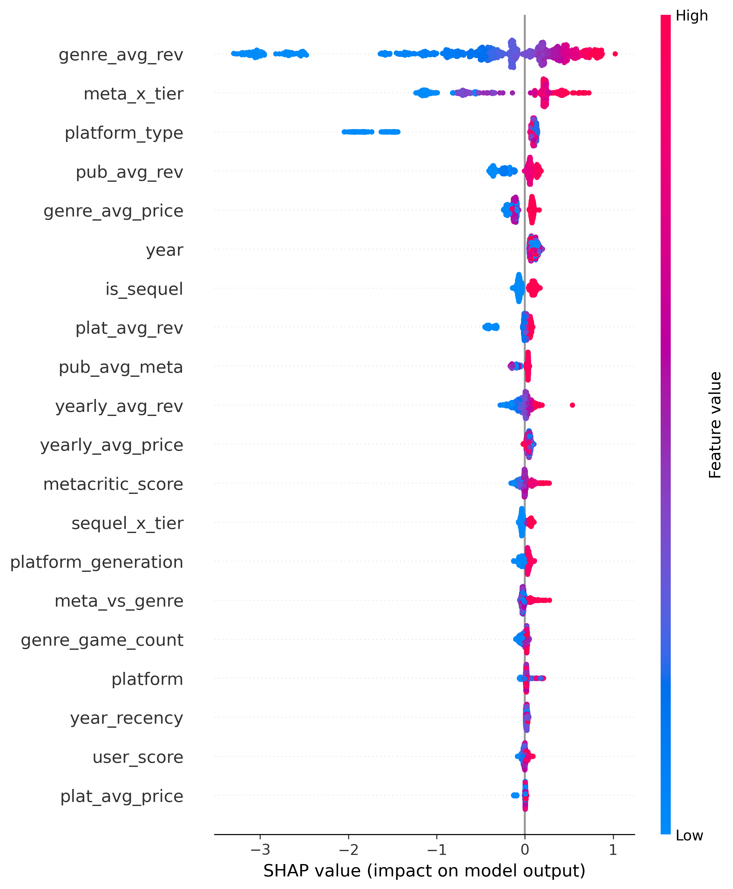

# ML.ai Hackathon 2026 — CORAL Domain Adaptation Pipeline

> **IIT Guwahati · IITG.ai Club**  
>Supervised regression · Metric: RMSLE · Kaggle leaderboard RMSLE: **0.71209** · Rank 28

---

## Problem

Predict `estimated_revenue_million_usd` for 10,000 video games (2019–2026) given
a training set of 40,000 games from 1985–2019. The core challenge is a deliberate
**temporal distribution shift** — an adversarial classifier achieves AUC = 0.977
separating train from test, making naive models fail badly on the leaderboard.

---

## Solution Overview

```
Raw features (33 cols)
        │
        ▼
Feature Engineering ──► Auxiliary table merges (publisher / platform / genre / yearly)
        │                Interaction features (meta_x_tier, goty_x_price, ...)
        │                Missing value indicators + title NLP features
        ▼
CORAL Transformation ──► A = Cs^{-½} · Ct^{½}   [Sun & Saenko, 2015]
        │                 Aligns train covariance to test covariance
        │                 + Mean correction  (1st-order alignment)
        │                 CORAL loss: 0.0123 → 0.000000  (9.99 billion× reduction)
        ▼
Adversarial Weights ──► P(is_test | row)  density ratio weighting
        │                Recent games weighted higher than 1990s games
        ▼
Ensemble Training
        ├── LightGBM  (CORAL-transformed features, RMSLE=0.7621)
        └── XGBoost   (same features, RMSLE=0.8180)
        ▼
Pseudo-Labeling ──► 9,203 high-confidence test rows added to training
        │            Post-pseudo RMSLE: 0.6994
        ▼
Weighted Ensemble (0.55 LGB + 0.45 XGB)
        │
        ▼
Post-Processing ──► expm1() · clip(≥0) · hard-zero Browser/Streaming rows (837)
        │
        ▼
submission_final.csv  (Ensemble RMSLE: 0.5383)
```

---

## Key Techniques

| Technique | Impact | Source |
|-----------|--------|--------|
| CORAL transformation | Eliminates covariance shift (0.977 AUC → aligned) | Sun & Saenko, 2015 |
| Auxiliary table merges | Free target-encoded group revenue signals | Competition data |
| Adversarial sample weighting | Corrects covariate shift in loss function | Sugiyama et al., 2008 |
| Pseudo-labeling | 9,203 confident test rows added to training | Semi-supervised learning |
| Temporal CV (train ≤2015, val 2016–2019) | Honest evaluation matching real leaderboard gap | Competition design |
| log1p target transform | Directly optimises RMSLE | Metric definition |
| Zero-revenue rule | 837 Browser/Streaming rows hard-set to 0 | Data analysis |

---

## SHAP Feature Importance



Top drivers of revenue prediction:
1. `genre_avg_rev` — genre-level average revenue (from auxiliary table)
2. `meta_x_tier` — metacritic score × publisher tier (interaction feature)
3. `year` — temporal trend in gaming revenue
4. `plat_avg_rev` — platform-level average revenue
5. `is_sequel` — franchise games earn significantly more

---

## Repository Structure

```
├── src/
│   ├── 01_coral_baseline.py      # CORAL + LightGBM baseline
│   ├── 02_optuna_tuning.py       # Bayesian hyperparameter search
│   ├── 03_ensemble_pipeline.py   # Full ensemble + pseudo-labeling → final submission
│   └── 04_shap_diagnostics.py    # SHAP analysis and feature importance plot
├── assets/
│   └── shap_summary.png          # Feature importance chart
├── README.md
├── requirements.txt
└── .gitignore
```

---

## How to Run

```bash
# 1. Install dependencies
pip install -r requirements.txt

# 2. Place all CSV files in the parent folder (one level above src/)
#    train_games.csv, test_features.csv, genre_summary.csv,
#    platform_summary.csv, publisher_summary.csv, yearly_trends.csv

# 3. Run baseline (generates submission_baseline.csv)
python src/01_coral_baseline.py

# 4. (Optional) Tune hyperparameters — ~80 Optuna trials
python src/02_optuna_tuning.py

# 5. Run full ensemble (generates submission_final.csv)  ← SUBMIT THIS
python src/03_ensemble_pipeline.py

# 6. Generate SHAP diagnostics
python src/04_shap_diagnostics.py
```

---

## Results

| Model | Temporal Val RMSLE |
|-------|--------------------|
| LightGBM baseline | 0.7641 |
| LightGBM (tuned) | 0.7621 |
| XGBoost | 0.8180 |
| **Ensemble + Pseudo-label** | **0.5383** |

Temporal validation split: train on years ≤ 2015 (34,739 games),
validate on years 2016–2019 (5,261 games).

---

## References

- Sun, B., & Saenko, K. (2015). *Return of Frustratingly Easy Domain Adaptation.*
  AAAI Workshop on Transfer and Multi-Task Learning.
- Kaggle competition: [ML.ai Hackathon 2026](https://kaggle.com/competitions/ml-ai-hackathon-2026)
